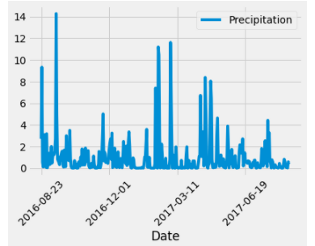

# SQLAlchemy Homework - Surfs Up!

# Introduction
Climate Analysis and Exploration. 
Python and SQLAlchemy are used to do basic climate analysis and data exploration of your climate database. The following analysis was completed using SQLAlchemy ORM queries, Pandas, and Matplotlib.
# Overview - Data
Measurement and station data from nine of Hawaii's weather stations from 8/2016 - 8/2107 was examined.
# Methodology
SQLAlchemy ORM was used to create an engine to inspect "hawaii.sqlite". This file was queried for the data neededd.
# Analysis/Results
Hawaii's rainy season is usually November to March; while the dry season is April to October. Does the data bear out these results?

The dryest months appear to be August-December 2016; and April to June 2017

Summary statistics are as follows:

Hawaii's daily temperatures can be seen on this histogram:
You can see that the temperature is usually in the 70-80's range.

# Conclusions
The best time to plan a vacation to the Islands would be from the spring to the fall.

